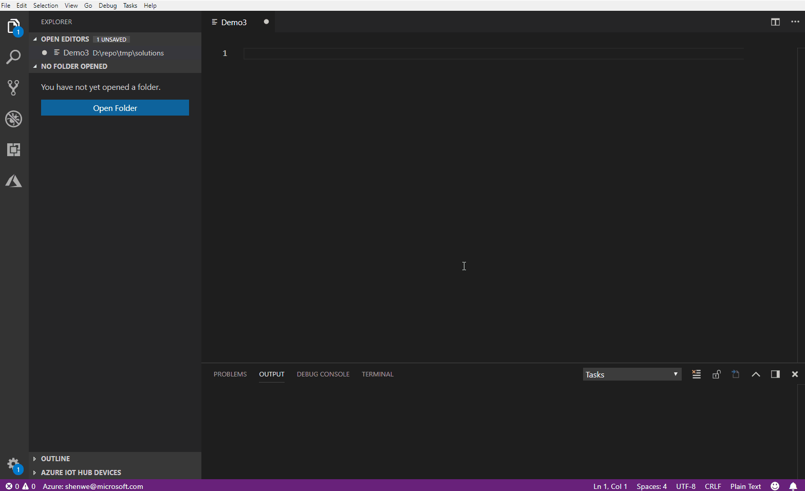

# Azure IoT Edge for Visual Studio Code
[](https://gitter.im/Microsoft/vscode-azure-iot-edge)

## Announcement
The Azure IoT Visual Studio Code extension is in a maintenance mode. Please see [this announcement](https://github.com/microsoft/vscode-azure-iot-edge/issues/639) for more details. We recommend using the [command line steps](https://learn.microsoft.com/en-us/azure/iot-edge/how-to-vs-code-develop-module?view=iotedge-1.4&branch=pr-en-us-203829&tabs=csharp&pivots=iotedge-dev-cli) to develop edge modules over VSCode extensions.

## Overview
[Azure IoT Edge extension](https://marketplace.visualstudio.com/items?itemName=vsciot-vscode.azure-iot-edge) makes it easy to code, build, deploy, and debug your [IoT Edge](https://docs.microsoft.com/azure/iot-edge/how-iot-edge-works) solutions in Visual Studio Code, by providing a rich set of functionalities:

- Create new IoT Edge solution
- Add new IoT Edge module to Edge solution
- Build and publish IoT Edge modules
- Debug IoT Edge modules locally and remotely
- IntelliSense and code snippets for the deployment manifest
- Manage IoT Edge devices and modules in IoT Hub (with [Azure IoT Toolkit](https://marketplace.visualstudio.com/items?itemName=vsciot-vscode.azure-iot-toolkit))
- Deploy IoT solutions to IoT Edge devices




## What's New (v1.25.11)
* Update default Edge runtime version to 1.4 LTS

## What's New (v1.25.10)
* Snap to the latest simulator version 0.14.18

## What's New (v1.25.9)
* Snap to the latest simulator version 0.14.14

## What's New (v1.25.8)
* Snap to the latest simulator version 0.14.12

## What's New (v1.25.0)
* Generate Dev Container definition files with new Edge Solutions.
* Ability to add Dev Container definition files to existing Edge Solutions.

## What's New (v1.22.0)
### Changed
* Allow user to select deployment template when add module
* Adopt VS Code's 'asWebviewUri' API

## Known Issues
* [C module remote debug error](https://github.com/Microsoft/vscode-azure-iot-edge/issues/283)
* Cannot run C and Python module in IoT Edge Simulator
* IoT Edge Simulator does not work on Windows Container
* [ASA module may fail sending message](https://github.com/Microsoft/vscode-azure-iot-edge/issues/213)
* ["Entry not found in cache" error when importing ACR and ASA modules](https://github.com/Microsoft/vscode-azure-iot-edge/issues/161)
* [Node.js module template version is not applied when another version is installed globally](https://github.com/Microsoft/vscode-azure-iot-edge/issues/340)
* [Access is denied when debugging C# module on macOS](https://github.com/Azure/iotedgehubdev/issues/30#issuecomment-514964933)

## Prerequisites for Azure IoT Edge extension

You need to install prerequisites below to make Azure IoT Edge extension work: 
- [Docker](https://www.docker.com/)
- [Python](https://www.python.org/downloads/) and [Pip](https://pip.pypa.io/en/stable/installing/#installation)
- [iotedgehubdev](https://pypi.org/project/iotedgehubdev/)
    ```
    pip install --upgrade iotedgehubdev
    ```
- It's also recommended to install [Docker Support for Visual Studio Code](https://marketplace.visualstudio.com/items?itemName=PeterJausovec.vscode-docker) to manage your IoT Edge Docker images, containers and registries. 
- The current user must have permissions to manage Docker. By default this is not the case on Linux, check the [FAQ section](#FAQ) to avoid `permission denied` errors.

## Prerequisites for specific language
To develop IoT Edge modules you also need to install following prerequisites for specific language:
  #### C# module prerequisites
  - [.NET Core 2.1 SDK or higher](https://www.microsoft.com/net/download). ([.NET Core 3.0 SDK or higher](https://dotnet.microsoft.com/download/dotnet-core/3.0) is required for ARM64 (preview) support. Please read the instruction [here](https://devblogs.microsoft.com/iotdev/develop-and-debug-arm64-iot-edge-modules-in-visual-studio-code-preview/) for more details).
  - [C# for Visual Studio Code (powered by OmniSharp) extension](https://marketplace.visualstudio.com/items?itemName=ms-vscode.csharp)
  - [Prerequisites for Azure IoT Edge extension](#Prerequisites-for-azure-iot-edge-extension)

  #### C# Functions on IoT Edge prerequisites
  - [.NET Core 2.1 SDK or higher](https://www.microsoft.com/net/download)
  - [C# for Visual Studio Code (powered by OmniSharp) extension](https://marketplace.visualstudio.com/items?itemName=ms-vscode.csharp)
  - [Prerequisites for Azure IoT Edge extension](#Prerequisites-for-azure-iot-edge-extension)

  #### Python module prerequisites
  - [Python](https://www.python.org/downloads/) and [Pip](https://pip.pypa.io/en/stable/installing/#installation)
  - [Git](https://git-scm.com/downloads) for cloning module template from GitHub
  - [Python extension](https://marketplace.visualstudio.com/items?itemName=ms-python.python) for Visual Studio Code
  - [Prerequisites for Azure IoT Edge extension](#Prerequisites-for-azure-iot-edge-extension)

  #### Node.js module prerequisites
  - [Node.js and npm](https://nodejs.org/)
  - [Yeoman](https://yeoman.io/)
  - [Prerequisites for Azure IoT Edge extension](#Prerequisites-for-azure-iot-edge-extension)

  #### Java module prerequisites
  - [Java SE Development Kit](https://aka.ms/azure-jdks), and [set the JAVA_HOME environment variable](https://docs.oracle.com/cd/E19182-01/820-7851/inst_cli_jdk_javahome_t/) to point to your JDK installation.
  - [Maven](https://maven.apache.org/)
  - [Java Extension Pack](https://marketplace.visualstudio.com/items?itemName=vscjava.vscode-java-pack) for Visual Studio Code.
  - [Prerequisites for Azure IoT Edge extension](#Prerequisites-for-azure-iot-edge-extension)

  #### C module prerequisites
  - [Git](https://git-scm.com/downloads) for cloning module template from GitHub
  - [C/C++ extension](https://marketplace.visualstudio.com/items?itemName=ms-vscode.cpptools) for Visual Studio Code.
  - [Prerequisites for Azure IoT Edge extension](#Prerequisites-for-azure-iot-edge-extension)

## Quickstart
Click the links below to learn how to develop, debug and deploy IoT Edge modules.

- [C# module](https://docs.microsoft.com/azure/iot-edge/tutorial-csharp-module)
- [C# Functions on IoT Edge](https://docs.microsoft.com/azure/iot-edge/tutorial-deploy-function)
- [Python module](https://docs.microsoft.com/azure/iot-edge/tutorial-python-module)
- [Node.js module](https://docs.microsoft.com/azure/iot-edge/tutorial-node-module)
- [Java module](https://docs.microsoft.com/azure/iot-edge/tutorial-java-module)
- [C module](https://docs.microsoft.com/azure/iot-edge/tutorial-c-module)

## FAQ

> **Q:** All too often, I forget to save a config file, and when I build the docker image. Can we auto-save files before build?
>
> **A:** By default, VS Code requires an explicit action to save your changes to disk, `Ctrl+S`. However, it's easy to turn on [Auto Save](https://code.visualstudio.com/docs/editor/codebasics#_save-auto-save)


> **Q:** How to work with Python virtual environment?
>
> **A:** The Python extension manages your virtual environments in the workspace folder. Please refer to [Environments](https://code.visualstudio.com/docs/languages/python#_environments) and [Automatic Activation of Environments in the Terminal](https://blogs.msdn.microsoft.com/pythonengineering/2018/10/09/python-in-visual-studio-code-september-2018-release/) for details.


> **Q:** Help me understand IoT Edge deployment manifest.
>
> **A:** [Learn how to use deployment manifests to deploy modules and establish routes](https://docs.microsoft.com/azure/iot-edge/module-composition)

> **Q:** If I run this extension on Linux (e.g. Ubuntu), when executing docker commands (e.g. the `Build IoT Edge Module Image` command), the terminal shows `permission denied` errors. How can I fix this, and avoid having to prefix every command manually with `sudo`?
>
> **A:** This extension assumes the current user has sufficient privileges to run docker commands. On Linux you can add the current user to the `docker` group by executing the following commands:
> - To create the group: `sudo groupadd docker`
> - To add the current user to it: `sudo usermod -aG docker $USER`
>
> After executing these commands exit your Terminal session and restart Docker (`sudo systemctl restart docker`). Or you can reboot the machine completely. Check the [Post-installation steps for Linux](https://docs.docker.com/install/linux/linux-postinstall/#manage-docker-as-a-non-root-user) in the Docker documentation for more information on how to manage Docker as a non-root user.

## Commands

Press `F1` or `Ctrl + Shift + P` to open command palette, type `Azure IoT Edge:` to see all the commands:
- **Azure IoT Edge: New IoT Edge Solution**: Create an IoT Edge solution.
- **Azure IoT Edge: Add IoT Edge Module**: Add a new IoT Edge module to the IoT Edge solution.
- **Azure IoT Edge: Build IoT Edge Module Image**: Containerize IoT Edge module from source code. 
- **Azure IoT Edge: Build and Push IoT Edge Module Image**: Containerize and push IoT Edge module image to a Docker registry.
- **Azure IoT Edge: Build IoT Edge Solution**: Build all the IoT Edge module image in the solution and expand deployment manifest. 
- **Azure IoT Edge: Build and Push IoT Edge Solution**: Build and push all the IoT Edge module image in the solution and expand deployment manifest.
- **Azure IoT Edge: Setup IoT Edge Simulator**: Setup IoT Edge Simulator with an edge device connection string.
- **Azure IoT Edge: Build and Run IoT Edge Solution in Simulator**: Build all the IoT Edge module image in the solution and expand deployment manifest. Then run the solution in IoT Edge Simulator.
- **Azure IoT Edge: Run IoT Edge Solution in Simulator**: Run the solution of the given deployment manifest in IoT Edge Simulator.
- **Azure IoT Edge: Start IoT Edge Hub Simulator for Single Module**: Start the IoT Edge Simulator for testing single module. It will ask for the input names of the module.
- **Azure IoT Edge: Stop IoT Edge Simulator**: Stop IoT Edge Simulator.
- **Azure IoT Edge: Set Module Credentials to User Settings**: Set the module credential into "azure-iot-edge.EdgeHubConnectionString" and "azure-iot-edge.EdgeModuleCACertificateFile" in user settings. The credentials could be used to connect IoT Edge Simulator.
- **Azure IoT Edge: Create deployment for Edge device**: Create and submit the deployment to your IoT Edge device with specified deployment manifest. 

You can also trigger following frequently-used commands in context menu.
- **Azure IoT Edge: Add IoT Edge Module**: The context menu of `deployment.template.json` file or `modules` folder in VS Code file explorer. A new module will be added to the `modules` folder.
- **Azure IoT Edge: Build IoT Edge Solution**: The context menu of `deployment.template.json` file in VS Code file explorer.
- **Azure IoT Edge: Build and Push IoT Edge Solution**: The context menu of `deployment.template.json` file in VS Code file explorer.
- **Azure IoT Edge: Build and Run IoT Edge Solution in Simulator**: The context menu of `deployment.template.json` file in VS Code file explorer.
- **Azure IoT Edge: Generate IoT Edge Deployment Manifest**: The context menu of `deployment.template.json` file in VS Code file explorer. The deployment manifest (deployment.json) will be expanded from deployment.template.json.
- **Azure IoT Edge: Build IoT Edge Module Image**: The context menu of the `module.json` file in VS Code file explorer. With the input platform from user, it will build the image with the target Dockerfile.
- **Azure IoT Edge: Build and Push IoT Edge Module Image**: The context menu of the `module.json` file in VS Code file explorer. With the input platform from user, it will build and push image with the target Dockerfile.
- **Azure IoT Edge: Create deployment for Edge device**: The context menu of an IoT Edge device in device list. Create a deployment for target IoT Edge device with deployment manifest file you select.
- **Azure IoT Edge: Edit module twin**: The context menu of a deployed module in device list. Fetch target module twin and then update it in edit view. 

## Code Snippets

| Trigger | Content |
| ---- | ---- |
| edgeModule | Add IoT Edge module in IoT Edge deployment manifest |
| edgeRoute | Add IoT Edge route in IoT Edge deployment manifest |

## Resources
- [Video tutorial - Azure IoT Edge extension for Visual Studio Code](https://channel9.msdn.com/Shows/Internet-of-Things-Show/Azure-IoT-Edge-extension-for-Visual-Studio-Code)
- [Develop and deploy a C# module](https://docs.microsoft.com/azure/iot-edge/tutorial-csharp-module)
- [Develop and deploy a Python module](https://docs.microsoft.com/azure/iot-edge/tutorial-python-module)
- [Develop and deploy a Node.js module](https://docs.microsoft.com/azure/iot-edge/tutorial-node-module)
- [Develop and deploy a C module](https://docs.microsoft.com/azure/iot-edge/tutorial-c-module)
- [Register a new Azure IoT Edge device](https://docs.microsoft.com/en-us/azure/iot-edge/how-to-register-device)
- [Deploy Azure IoT Edge modules](https://docs.microsoft.com/azure/iot-edge/how-to-deploy-modules-vscode)
- [Debug C# module](https://docs.microsoft.com/azure/iot-edge/how-to-develop-csharp-module)
- [Debug Node.js module](https://docs.microsoft.com/azure/iot-edge/how-to-develop-node-module)
- [Debug Java module](https://docs.microsoft.com/azure/iot-edge/how-to-develop-java-module)
- [Debug Python module](https://docs.microsoft.com/azure/iot-edge/how-to-develop-python-module)
- [Debug C# Functions module](https://docs.microsoft.com/azure/iot-edge/how-to-develop-csharp-function)
- [CI/CD in VSTS](https://docs.microsoft.com/azure/iot-edge/how-to-ci-cd)

## Supported Operating Systems
Currently this extension supports the following operating systems:
- Windows 7 and later (32-bit and 64-bit)
- macOS 10.10 and later
- Ubuntu 16.04

The extension might work on other Linux distros as some users have reported, but be aware that Microsoft provides no guarantee or support for such installations.
You can find Azure IoT Edge support [here](https://docs.microsoft.com/azure/iot-edge/support).

## TypeEdge (Experimental)
The Azure IoT TypeEdge introduces a **strongly-typed** flavor of the inherently loosely coupled vanilla Azure IoT Edge. We would like to invite you to try TypeEdge out and give us any feedback or recommendations you might have here. TypeEdge is still an experimental project that we don’t recommend to use it in production IoT Edge project.

To get started, please visit the [project repo](https://aka.ms/typeedge) and give us feedback via [Github Issues](https://github.com/Azure/TypeEdge/issues).

## Data/Telemetry
This project collects usage data and sends it to Microsoft to help improve our products and services. Read our [privacy statement](http://go.microsoft.com/fwlink/?LinkId=521839) to learn more. 
If you don’t wish to send usage data to Microsoft, you can set the `telemetry.enableTelemetry` setting to `false`. Learn more in our [FAQ](https://code.visualstudio.com/docs/supporting/faq#_how-to-disable-telemetry-reporting).

## Support and Contact Us
You can join in our [Gitter](https://gitter.im/Microsoft/vscode-azure-iot-edge) to ask for help, report issues and talk to the product team directly.
