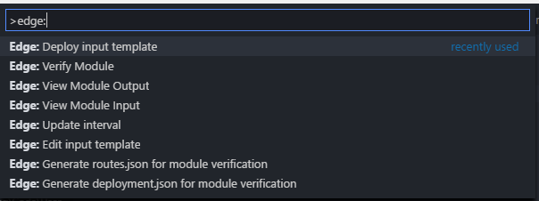

# Azure IoT Edge for Visual Studio Code
[]()
[]()

## Overview
Azure IoT Edge extension <sup>Preview</sup> makes it easy to code, build, deploy and debug your [IoT Edge]() solutions in Visual Studio Code, with a rich set of functionalities:

- Create new IoT Edge project
- Build and publish IoT Edge modules
- Debug IoT Edge modules locally
- Verify IoT Edge modules with input output simulator and message template
- Manage IoT Edge devices in IoT Hub
- Deploy IoT solution to IoT Edge device
- Stop and clean IoT Edge solutions
- JSON intellisense for `edge-config.json`

## Prerequisites

- [Docker](https://www.docker.com/)

For C# developers, you can write [custom module]() and [C# Functions on IoT Edge]()
- [IoT Edge .Net Core module template]()
- [IoT Edge C# function template]()
- [.Net Core 2.0 SDK](https://www.microsoft.com/net/download/core)
- [C# for Visual Studio Code](https://marketplace.visualstudio.com/items?itemName=ms-vscode.csharp)

For Node.js developers, you can write [Node.js Functions on IoT Edge]()
- [IoT Edge Node.js Funtcion generator]()

For Java developers, you can write [Java Functions on IoT Edge]()
- [Maven plugin for IoT Edge Java Function]()

For C developers, you can write custom module, please refer to [IoT Edge C samples]()

## Change Log
See the [Change log]() for the details of changes for each version.

## Installation
Open VSCode and press `F1` or `Ctrl + Shift + P` to open command palette, select **Install Extensions** and type `vscode-azure-iot-edge`.

Or lanuch VSCode Quick Open (Ctrl + P), paste the following command, and press enter,

```bash
ext install vscode-azure-iot-edge
```

You can also install directly from Marketplace with VSCode by searching `Azure IoT Edge`.

## Get Started with IoT Edge in VS Code

- [Documentation]()
- [Video Tutorial]()
- [IoT Edge samples on Github]()

## Commnads

Press `F1` or `Ctrl + Shift + P` to open command palette, type `Edge:` to see all the commands:


- Commands0: Description TBD.
- Commands1: Description TBD.
- Commands2: Description TBD.

## Options
The following Visual Studio Code settings are available for the Azure IoT Edge extension. These can be set in global user preferences `Ctrl + ,` or workspace settings (.vscode/settings.json). The later overrides the former.

```json
{
    "TBD": "TBD"
}
```

## Supported Operating Systems
Currently this extension supports the following operatings systems:
- Windows 7 and later (32-bit and 64-bit)
- macOS 10.10 and later
- Ubuntu 16.04
  - The extension might work on other Linux distro as some user reported but without gurantee.

## Support
You can find the full list of issues at [Issue Tracker](https://github.com/Microsoft/vscode-arduino/issues). You can submit a [bug or feature suggestion](https://github.com/Microsoft/vscode-arduino/issues/new), and participate community driven [discussions](https://gitter.im/Microsoft/vscode-arduino).

## Development
Welcome to contribute to this extension!
Installing Prerequisites:

- [Git](https://git-scm.com/)
- [Node.js](https://nodejs.org/) (>= 6.5.0)
- [Npm](https://www.npmjs.com/) (>= 3.10.3)

To *run and develop*, do the following:
- `git clone https://github.com/microsoft/vscode-arduino`
- `cd vscode-arduino`
- Run `npm i`
- Run `npm i -g gulp`
- Open in Visual Studio Code (`code .`)
- Press `F5` to debug

To *test do the following*: `F5` in VS Code with the "Launch Tests" debug configuration.

## Code of Conduct
This project has adopted the [Microsoft Open Source Code of Conduct](https://opensource.microsoft.com/codeofconduct). For more information please see the [Code of Conduct FAQ](https://opensource.microsoft.com/codeofconduct/faq/#howadopt) or contact opencode@microsoft.com with any additional questions or comments.

## Privacy Statement
The [Microsft Enterprise and Developer Privacy Statement](https://www.microsoft.com/en-us/privacystatement/EnterpriseDev/default.aspx) describes the privacy statement of this software.

## License
This extension is licensed under [MIT License](https://github.com/Microsoft/vscode-arduino/blob/master/LICENSE.txt). Please see the [Third Party Notice](https://github.com/Microsoft/vscode-arduino/blob/master/ThirdPartyNotices.txt) file for additional copyright notices and terms.

## Contact Us
If you would like to help build the best Arduino experience with VS Code, you can reach us directly at [gitter chat room]().
